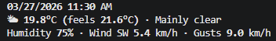

## 🌤️ WEATHER CLI
Fast • Simple • Terminal Weather

A fast, minimal command-line weather tool powered by Open-Meteo.


---

## Sample output 
```weathercli Los Angeles, CA --detailed```



```weathercli Los Angeles, CA --compact```


## Installation

### Recommended (via pipx)

```bash
pipx install "git+https://github.com/ChenchuH/WeatherCLI.git"
```

> Requires `pipx`

---

### Install pipx (Ubuntu / WSL)

```bash
sudo apt update
sudo apt install pipx
pipx ensurepath
```

Verify installation:

```bash
pipx --version
```

---

## Usage

```bash
weathercli <location>
```

### Examples

```bash
weathercli "Los Angeles, CA"
weathercli "New York"
weathercli "Vasto, Italy"
```

---

## Options

```bash
weathercli --help
```

| Flag         | Description                          |
|--------------|--------------------------------------|
| `--compact`  | Minimal output                       |
| `--detailed` | Full weather details                 |
| `--version`  | Show installed version               |

---

## Update

```bash
pipx upgrade weathercli
```

---

## Development
Be sure to install the requirements.txt when running locally
```bash
PYTHONPATH=src python -m weathercli.main "<location>"
```

Example:

```bash
PYTHONPATH=src python -m weathercli.main "Los Angeles, CA"
```

## Current Version **v1.0.3**

## Planned (v1.1.0)

- Unit selection (°C / °F)
- Weekly forecast
- More natural input handling

## License MIT

